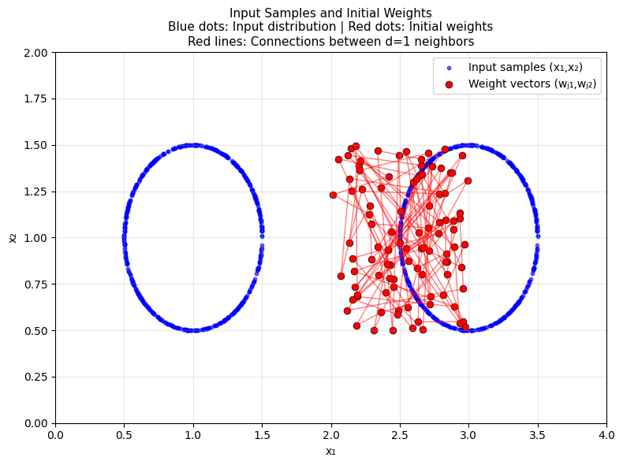
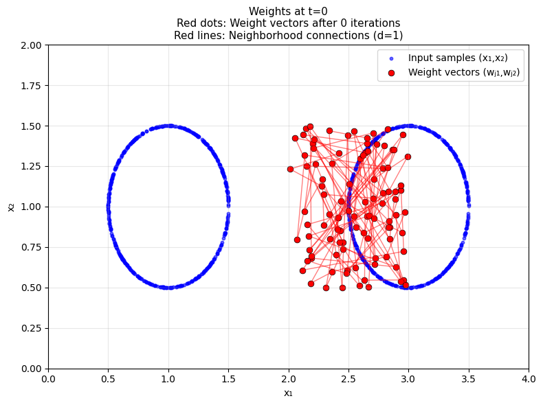
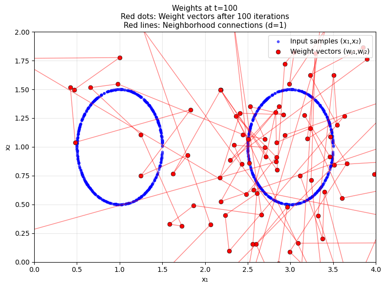
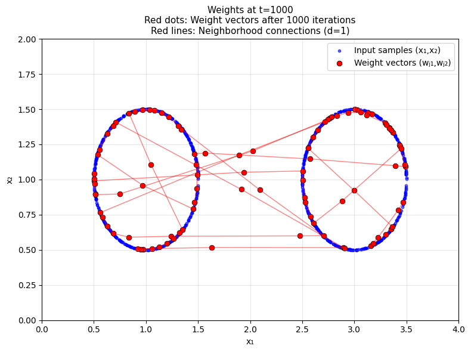

# Kohonen Self-Organizing Map (SOM) - Circular Input Distribution

This project implements a 1D Kohonen Self-Organizing Map (SOM) trained on a dataset of points sampled from **two circular clusters**.

It visualizes how the weight vectors evolve over training iterations using neighborhood-based competitive learning.

---

## 🔧 Features

- Generates 1000 data points from two circles.
- Initializes 100 weight vectors in a 2D space.
- Trains over 1000 steps with dynamic learning rate and neighborhood.
- Plots:
  - Initial weights and input samples
  - Evolution at t = 0, 100, 1000

---

## 📊 Output Visualizations

| Description | Image |
|-------------|-------|
| 🔵 Input samples + 🔴 Initial weights (Turn-in 2) |  |
| 🔵 Input samples + 🔴 Initial weights (Turn-in 3) |  |
| 🔴 Weights after 100 iterations |  |
| 🔴 Weights after 1000 iterations |  |

> 💡 Simply upload the `.png` images to the main directory of your GitHub repo (no subfolder needed). The above links will render them in the README.

---

## 🚀 How to Run on Google Colab

1. Run the script in Google Colab to generate all 4 `.png` images.
2. Use the following to download:
```python
from google.colab import files
files.download("turn_in_3_1000.png")  # or any other file
To download all at once:

python
Copy
Edit
import shutil
shutil.make_archive("images", 'zip', ".")
files.download("images.zip")
📁 Example Folder Structure
Copy
Edit
kohonen_som_project/
├── kohonen_som_training.py
├── turn_in_2_0.png
├── turn_in_3_0.png
├── turn_in_3_100.png
├── turn_in_3_1000.png
├── README.md
🧠 Concepts Used
Kohonen Self-Organizing Maps (SOM)

Competitive Learning & Topology Preservation

Dynamic Learning Rate & Neighborhood Decay

Data Visualization (matplotlib)

